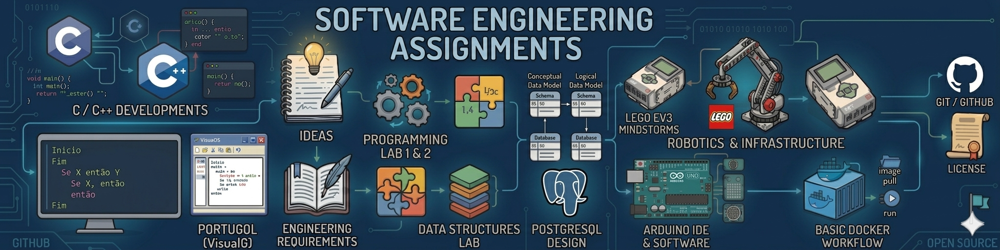

<p align="center">
  
</p>

# 📝 Software Engineering Assignments


# 🎓 University Programming Portfolio

> 💡 This repository is a centralized archive for the programming exercises and assignments developed during my Software Engineering degree.
>
> 📖 Here, I document my academic progress, covering everything from basic logic to data structures and robotics.
>
> **🔥 Note:** While this documentation is written in **English**, please note that all source code (variables, comments, and logic) was developed in **Portuguese**.

**👋 Hi! My name is Luiz Eduardo. I'm a Software Engineering student currently in my 3rd semester.**

## 📚 Summary

- 📌 [About the project](#-about)
- 🏗️ [Repository structure](#-repository-structure)
- 🧰 [Technologies used](#-technologies-used)
- 📁 [Project structure](#-project-structure)
- 🧪 [How to run the exercises](#-how-to-run-the-exercises)
- ⚙️ [Learning objectives](#-learning-objectives)
- 📊 [Project status](#-project-status)
- 📜 [License](#-license)
- 👤 [Author](#-author)

---

## 📌 About

This repository represents my journey through Software Engineering. It includes classroom assignments and supplementary exercises designed to strengthen my programming logic.

**Important Context:**
* **Digitization:** Many algorithms were originally solved on paper and have been recently translated to code (using VisuAlg or manually) to complete this digital portfolio.
* **Reconstruction:** Some files were rewritten from scratch or recovered because they were missing from the original college period.
* **Disparity:** Due to the conversion from paper to digital, some variations in implementation style may exist.

---

## 🏗️ Repository Structure

The projects are organized by semester and discipline:

### **1st Semester**
* Algorithms I
* Programming Lab I

### **2nd Semester**
* Algorithms II
* Programming Lab II
* Robotics I

### **3rd Semester**
* Data Structures Lab
* Database Modeling
* Robotics II

### **4rd Semester**
* object-oriented programming
* Database Design


## 🧰 Technologies Used

* **Languages:** C, C++, and Portugol (VisuAlg).
* **Tools:** VS Code, VisuAlg, DBeaver, and Git/GitHub.

## 📁 Project Structure

The repository follows this hierarchy:

```text
software-engineering-assignments/
├── 1st-semester/
│   └── [discipline-name]/
│       ├── assignments/    <-- Specific graded activities
│       └── exercises/      <-- Topic-based practice
├── 2nd-semester/
│   └── ...
├── 3rd-semester/
│   └── ...
└── 4th-semester/
    └── ...
````

## 🧪 How to run the exercises
Detailed execution steps are included in the **README.md** located inside each specific exercise or activity folder. Please refer to those files for compiler settings or VisuAlg instructions.

## ⚙️ Learning Topics & Objectives

Key concepts covered across Software Engineering assignments:

* **Core Programming & Memory:** Functions, Structs, Strings, File I/O, and Pointers.
* **Data Structures:** Stacks, Queues, Linked Lists, Hash Tables, and Binary Search Trees.
* **Algorithms & Analysis:** Sorting (Quick, Merge, Heap, etc.) and Big-O Time Complexity.
* **Database Engineering (PostgreSQL):** ER Modeling, Normalization (1NF–3NF), Relational Algebra, DDL, DML, and Advanced Joins/Aggregations.
* **Requirements Engineering:** Elicitation, Functional/Non-Functional, System, and Domain Requirements.

## 📊 Project Status

> 🚧 In Progress
> 
> I am actively updating the content and adding new activities as I progress through my university semesters.

## 📜 License

This project is licensed under the MIT License.

## 👤 Author

**Luiz Eduardo Marchi**